# Full Stack Development 2 - Assignment.

**Name:** Eoin Fennessy

## Features

[A bullet-point list of the features developed for the React SPA app (only new/modified ones for the Movies app),]

- Discover TV Shows Page
- TV Show Details Page
- My Fantasy Movies Page:
  - Create multiple fantasy movies using appropriate UI elements. i.e. date pickers, multi-select dropdowns, number pickers etc.
  - Validate all inputs
  - List all created fantasy movies
- List Cast/Crew for Movie in Movie Details Page (plus Hyperlinks for each)
- Person Details Page:
  - Profile Photo
  - Personal Info
  - Bio
  - Nested Accordion Components Showing Person's Cast Roles & Crew Jobs on Both Movies and TV Show (plus Hyperlinks for each)
- Filter Movies by Minimum Average Vote
- Filter Movies by Min and Max Release Date using Date Picker
- Paginated Movies, Upcoming, & TV Shows Pages including Caching on a Per-Page Basis
- User Auth
- Private Route Component with Stateful Login Redirection
- Auth-Context-Sensitive Navbar
- New StoryBook Stories for PersonCredits and PersonalInfo Components
- Vercel Deployment

## Feature Design

[ For each feature listed above, show a screenshot(s) of its UI layout (use appropriate magnification for accessibility). Include a caption with each image.]

#### Person Details Page

> Displays profile pic, various personal info, bio and movie/TV credits accordions

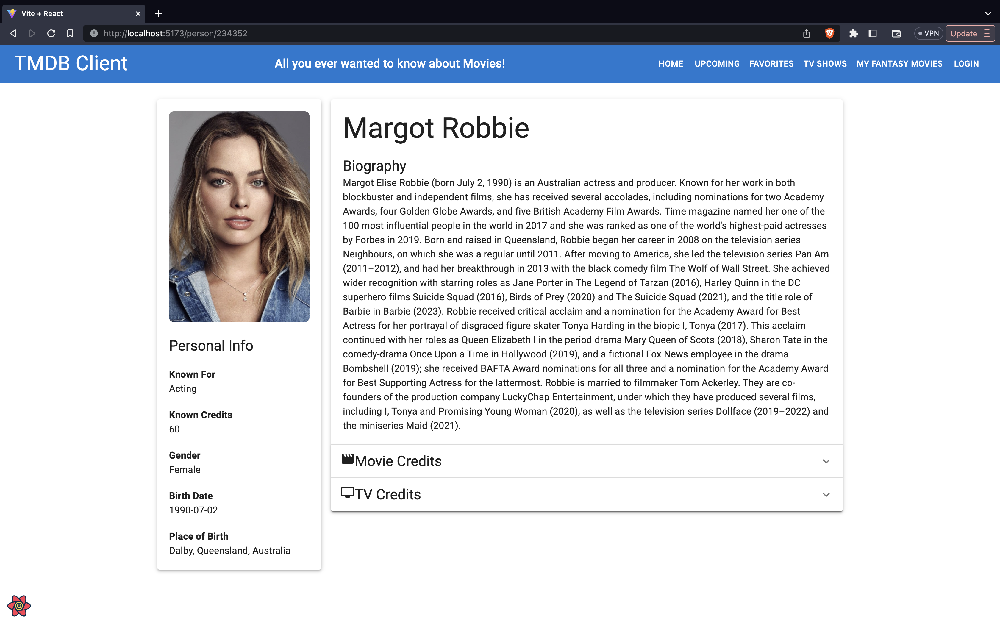

> Nested accordions are used to display TV and Movie credits for cast and crew roles. Hyperlinks and additional data about the person's role is displayed for each entry.

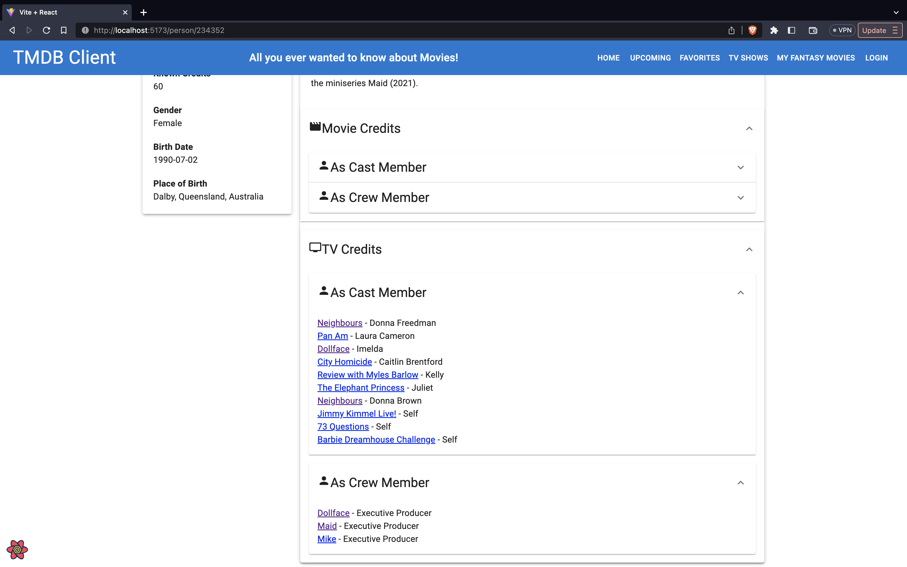

#### Discover TV Shows Page

> Lists TV shows from the 'discover' endpoint of TMDB

#### TV Show Details Page

> Details include count of seasons/episodes, ratings, first release date, season names, genres and production companies

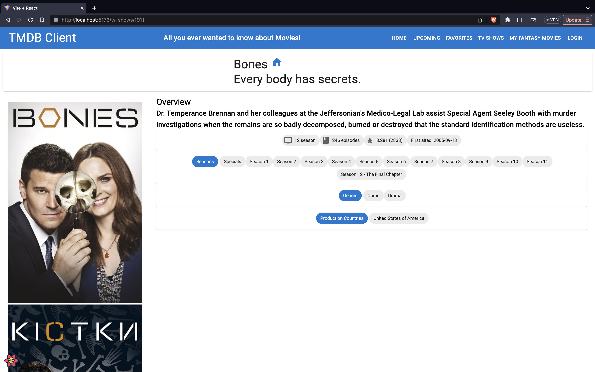

#### My Fantasy Movies Page

> Displays list of all user-created movies

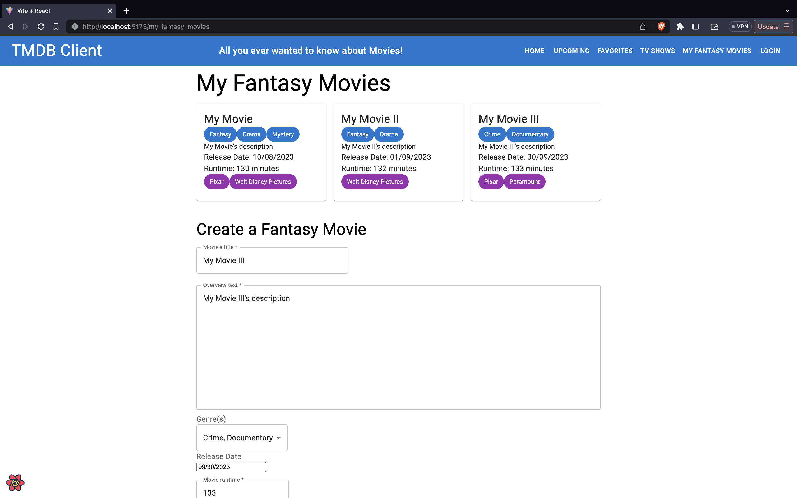

> Allows users to create their own movies using a form with appropriate UI input components (date-pickers, number fields, multi-select fields, etc.). Each field is validated.

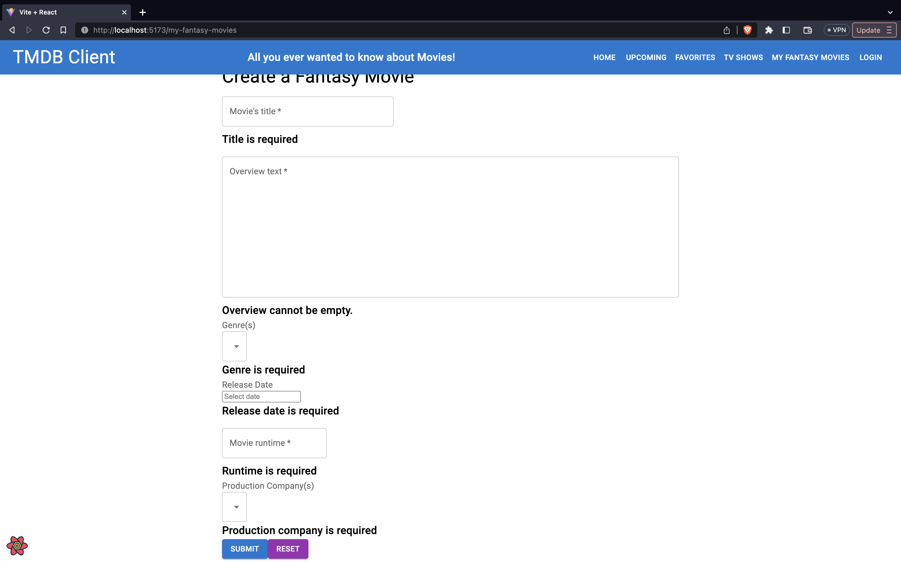

#### Movie Credits

> Dropdowns have been added for cast/crew credits for each movie.

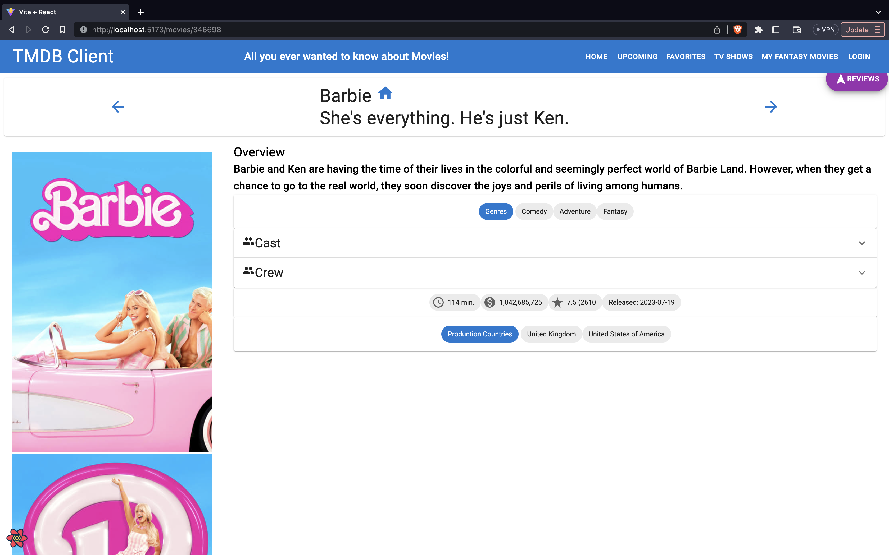

> The dropdowns contain the role/job for each person and hyperlinks to the person's 'details' page.

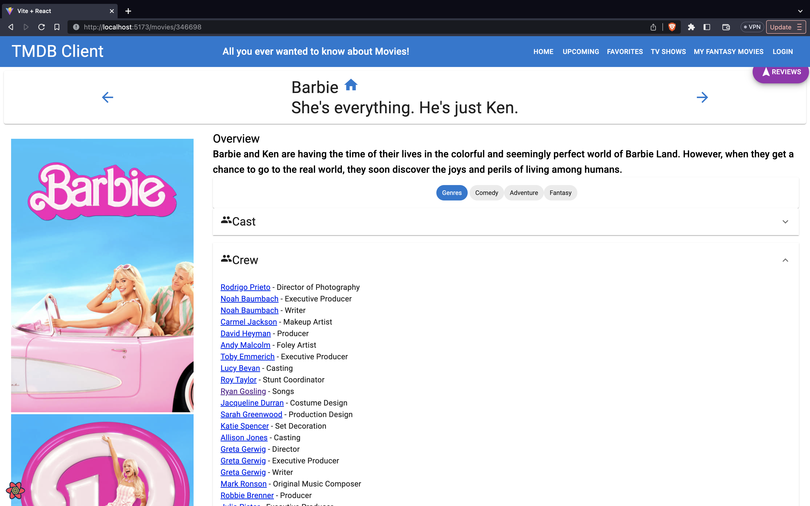

#### Filter Movies

> Movies can now be filtered by minimum average vote score using a number input and min/max release date using date picker inputs.

#### Auth/Protected Routes

> Basic login/logout functionality has been added to the app. Protected routes redirect to a stateful login page where the user is redirected back to the protected route upon sucessful login.

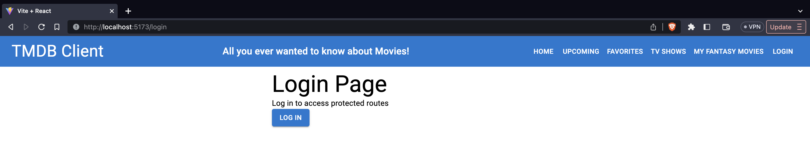

> The app's navbar is auth-context-sensitive and displays either login or logout buttons depending on its state.

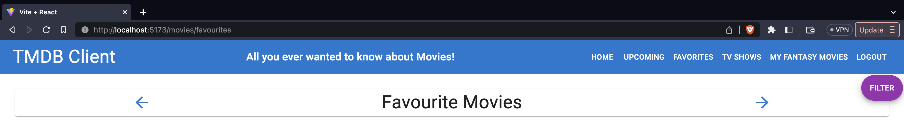

## Storybook

[Include a screenshot(s) from the Storybook UI and highlight the stories for new components developed.]

> Some additional Storybook stories have been added for some of the new components, and new sample data has been added.

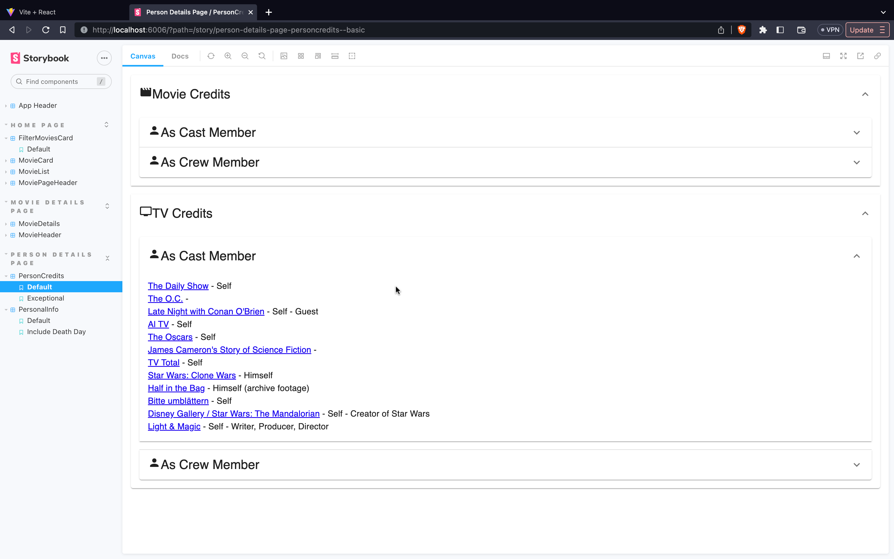

> The sample data has been modified in some cases to provide different/exceptional types of input to components.

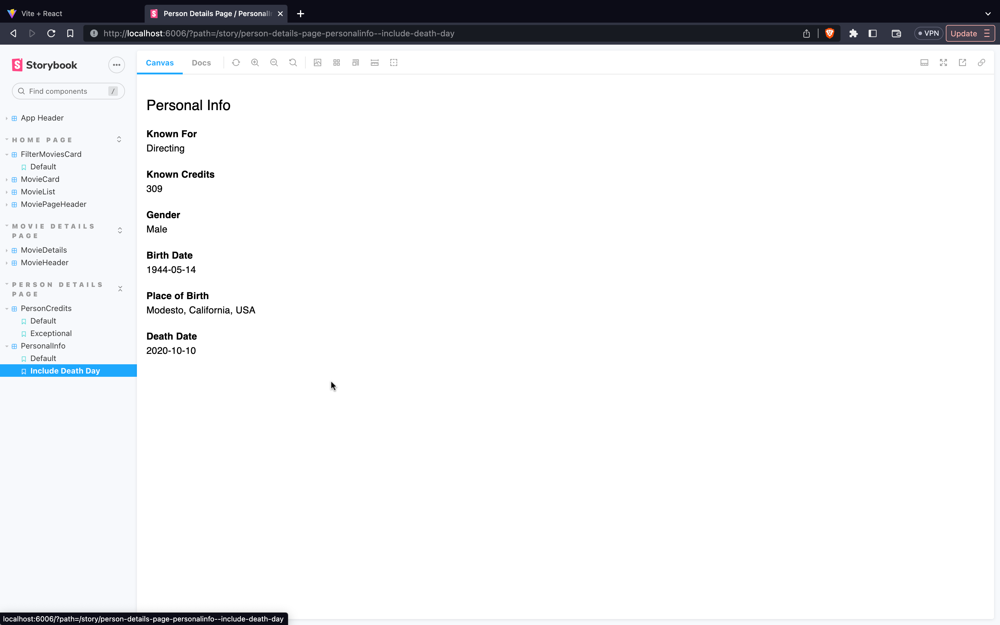

#### Protected routes

[List all the routes in your app and highlight those that are protected/private (require authentication).]

e.g.

- "/movies/upcoming"
- "/movies/favourites" - A private route
- "/movies/:id"
- "/reviews/:id"
- "/reviews/form"
- "/tv-shows"
- "/tv-shows/:id"
- "/person/:id"
- "/my-fantasy-movies"
- "/login"
- "/logout"
- "/"

#### Protected functionality. (if relevant)

[ Briefly state any app functionality that requires authentication, e.g. only authenticated users can tag a movie as a 'favourite'.]

Only authenticated users can access the 'favourites' page. Attempting to access this page when unauthenticated will redirect the user to the login page (and back again).

## Deployment (if relevant).

[Specify the URL of your deployed app and include a screenshot(s) from your deployment platform account (e.g. Vercal) that verifies its use for this app. Set up a registered user for your app and specify their credentials.
]

[https://movies-app-ef.vercel.app/](https://movies-app-ef.vercel.app/)
